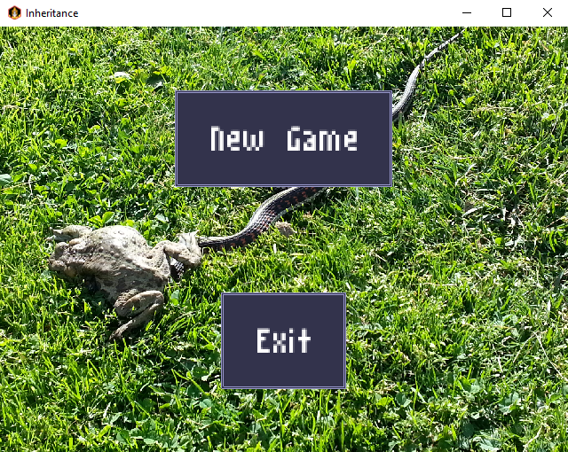
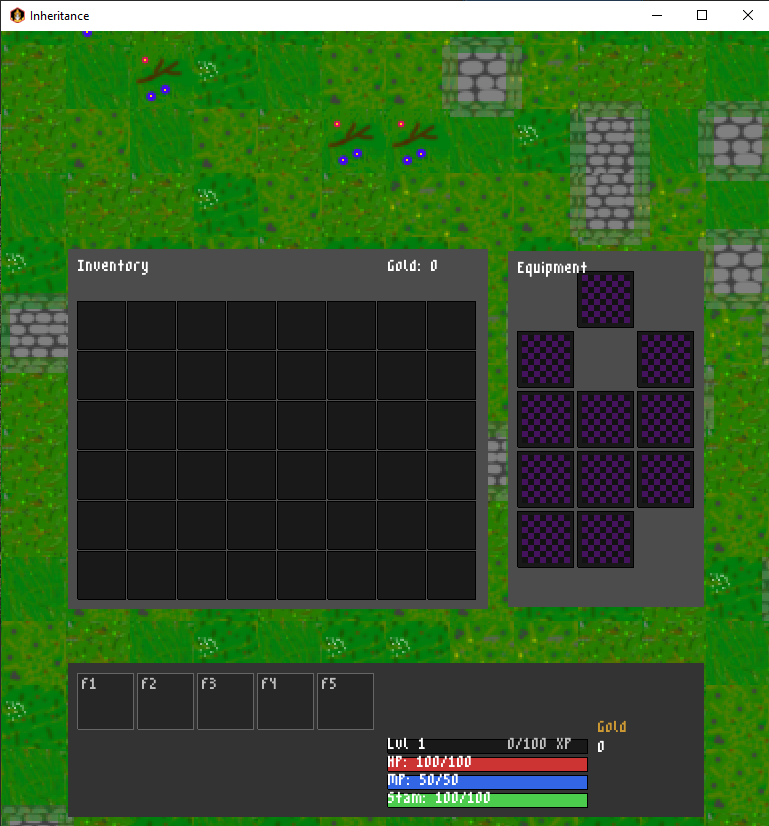
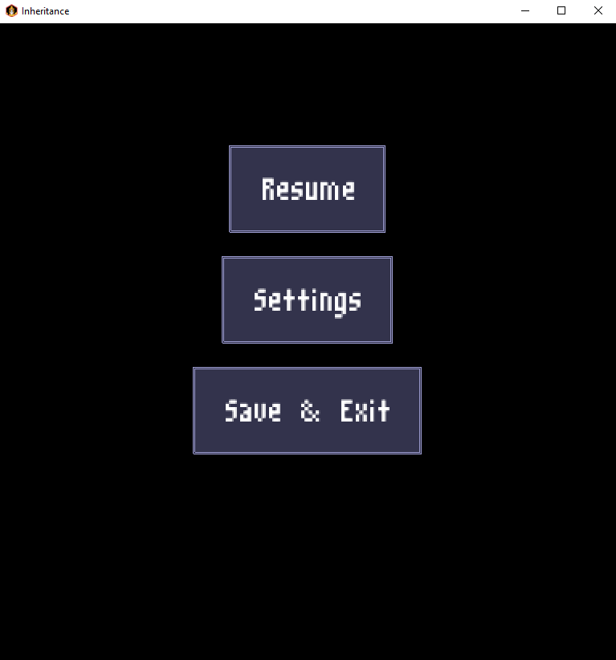
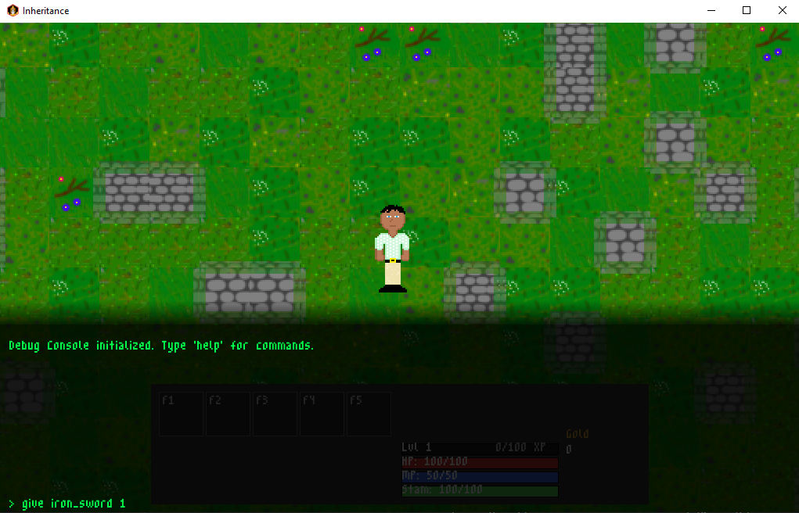
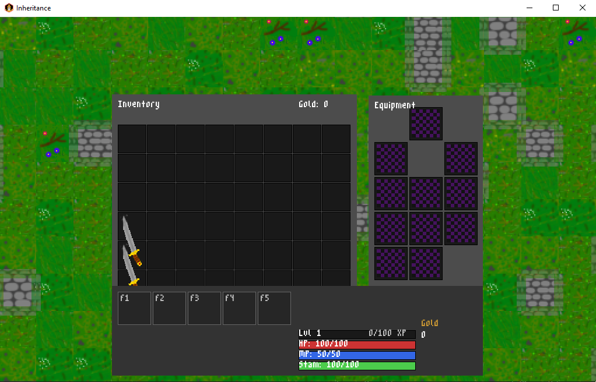
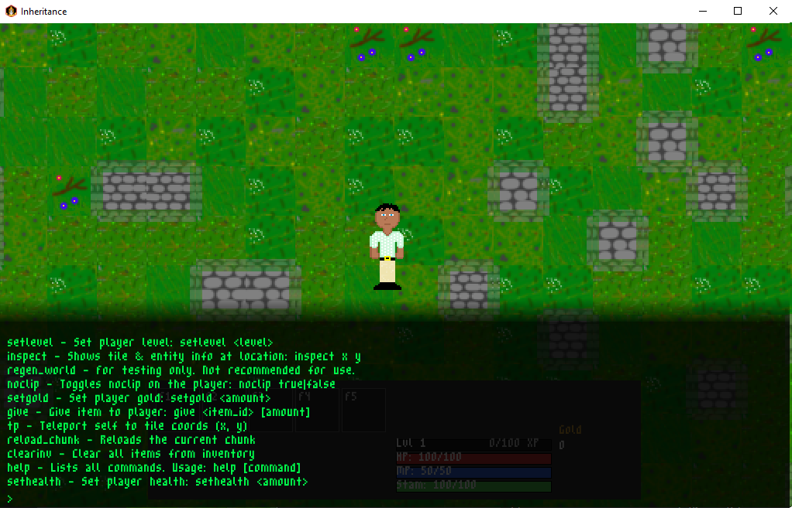
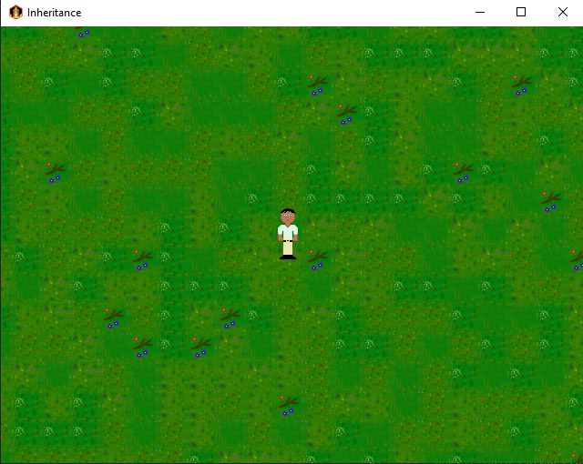
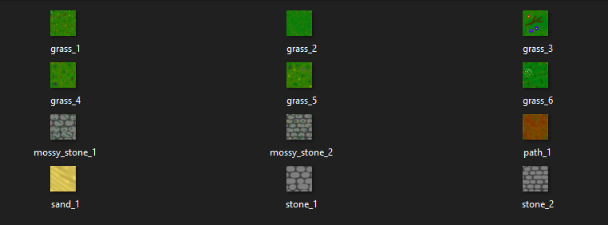
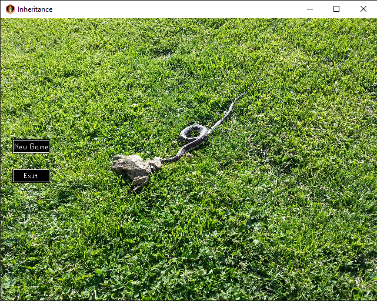
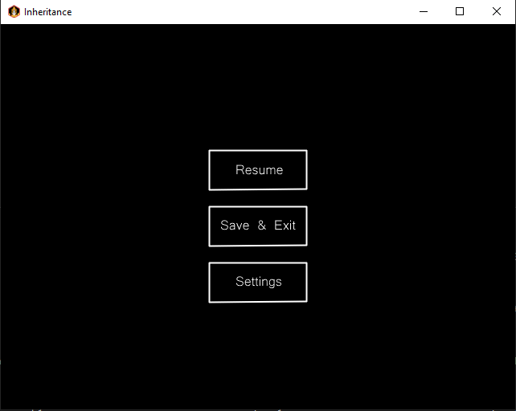

# Welcome to my development updates! The oldest updates will be at the bottom.

### Update 3:
This update focused on a lot of random things. I have this awful tendency when working on projects on my own to let progress sit on my computer so my last few commits have been pretty large and extensive. As the UI was built, it started making the game feel significantly more complete. I did something ambitious and decided to go with a 3D game before things got more complex. That meant I had to seriously fuss around with it and it was pretty hard to get a decent FPS given my hardware. I went from around a cap of 27 to a cap of 110. I will have to look into more optimizations as I build out a world. I also added a game camera that functions identically to Runescape.

I began working on save states for my next feature. This would help me save progress and jump right back in to whatever I may have been working on.

Then, I started attempting to separate the worlds from randomly generated to be static and allow me to introduce more complex things. If the idea I have in my head is to come to fruition, I will need a way to make a map static with NPCs, interactable objects, and other things. I am not great at using something like Blender, and I felt with my games simplicity, I can just create a Map Editor. The game is essentially like minecraft when it comes to how worlds are laid out, so I felt like this was the easiest thing to do. I believe this could be very handy in the future if I allow for any sort of world customization. I'm not sure yet, but I think it will be handy to have! I extended it to allow for tiles to be rotated and used as walls, which will allow for the construction of buildings. I also added some sound settings and the base for some sound classes. Once sounds and more 3D worlds are able to be created, this project will really start to feel real. Photos will be attached once it's more polished and I am able to easily construct a building.

With the idea I have in mind, this means worlds will be generated manually and on the fly in dungeons. However, I believe the way I am generating them right now is not very efficient and I will need to come up with a way to make it such that all these tiles do not hinder performance.

### Update 2:
This update was focused on UI and debugging. I spent a lot of time trying to figure out the player inventory system and fleshed out the rest of the debugging functions. I also dedicated a lot of time on displaying the hotbar, which is now visible at all times. But first, I decided to try and make tile blending better and figured I could spend some time experimenting with collision. Collision is honestly in a very poor state, which left me defeated and made me move on to developing these other features. Not a bad thing, as I wrote tons of code over a few days in order to get everything situated. I wanted the in-game UI to include a hotbar, similar to FATE, which means I needed to have four status bars. Of course, these player elements were not integrated yet. The inventory and equipment somewhat work, but need more development. For example, equipping something is not reflected on the player sprite since that is just a static image right now. I am at a crossroads, where I feel that I may have the opportunity to make this game 3D before it's too late, or I can work on other core game features such as fleshing out settings, refining movement more, save states, or more refined world generation - where the player is able to move from a static area, such as a town, to a randomly generated dungeon.

I also decided to move away from asset based menu buttons, and loaded in a font that I supported called m3x6. It is a pixel based font, which I felt suited the art style I am going for in a game where I am aiming for pixel based art. You can see it below:

Which allowed me to iterate further, and implement this in the pause menu, and game UI.

And when I iterated on the debug console earlier, I was able to get this UI:

When I added the give item command, I found an inventory bug that I am going to have to fix. It appears the asset is loading twice, which makes it appear to be an inventory tile taller than it should be.

However, I am proud to say the debug console works and all commands function as intended. The help command is especially useful, and I anticipate this pattern will help me in developing faster.

Overall, I am super pleased with how this is going so far. I have so many ideas and will look into making this 3D. I believe this could be what really makes it feel like a game, as it's hard for me to create assets that will fit will in the way stardew valley does. I also believe this will help in the future with items on the floor, hostile NPCs, buildings within the town, and make dungeons significantly more immersive and potentially scary.

### Update 1:
I spent most of my time focusing on world generation. I landed on 2D top-down graphics for simplicity, as this is my first game. With that in mind, I decided to then create a `World` class, which will generate `Chunks` of 8x8 `Tiles`. These tiles are random grass tiles so it does not look bland. Once I drew the character model in Paint.NET and a couple grass tiles, I was able to render the character and move it with WASD across tiles.

Somewhere in between, I needed to create different screens for the game to use. I knew it would be useful to go from a main menu and into the game, but also from the game into a pause menu. I have stubbed out a settings button for future use.

In this update, I have also started working on debugging tools. Although incomplete, I found it difficult to make progress without tools. I think starting on this in my first update will help me understand game development and programming in Java a lot more.